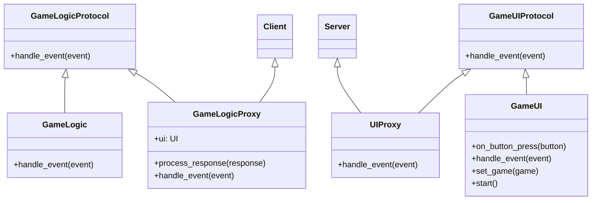
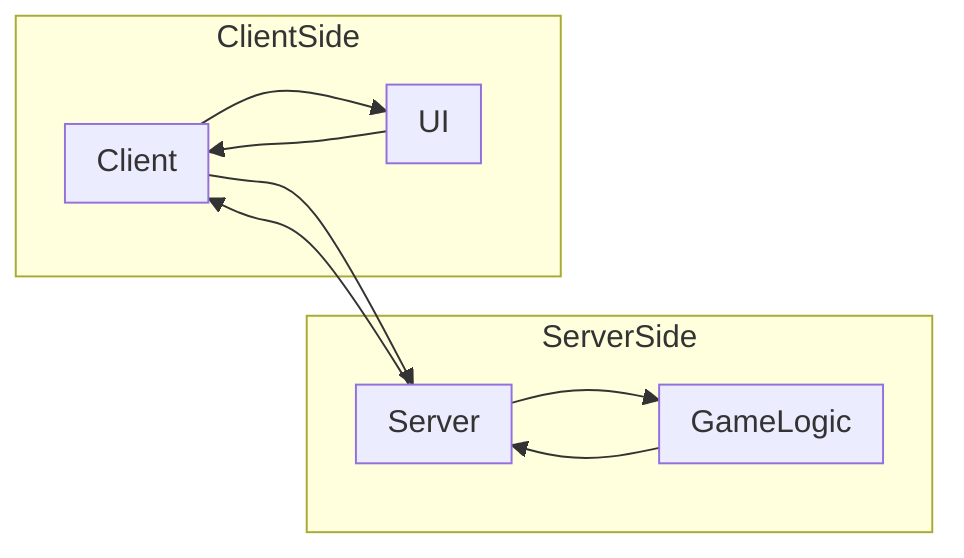
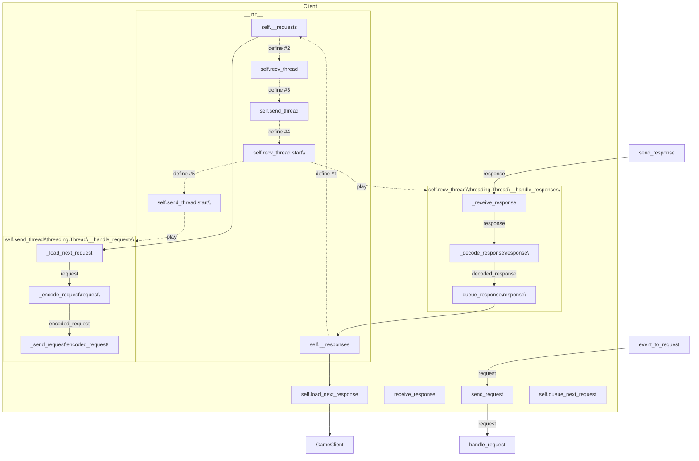
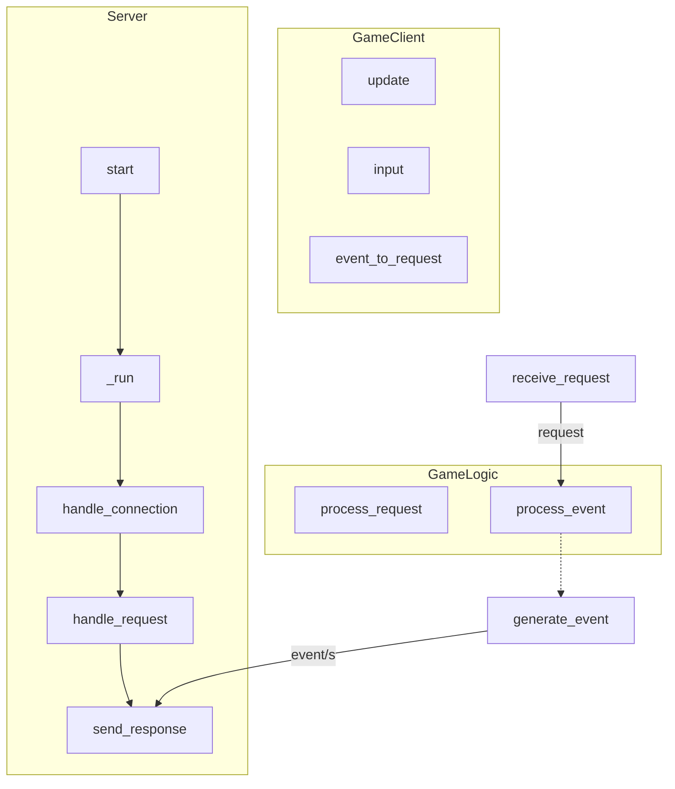

# ecs-game-engine

A piece of software or a framework aiming at covering the basics of gamedev

1.2.5. All classses

# TicTacToeGame Architecture example

```mermaid
classDiagram
    class GameUI{
        +on_button_press(button)
        +handle_event(event)
        +set_game(game)
        +start()
    }
    class GameLogicProxy{
        +ui: UI
        +process_response(response)
        +handle_event(event)
    }
    class Client

    class GameLogic{
        +handle_event(event)
    }
    class UIProxy{
        +handle_event(event)
    }
    class Server

    class GameUIProtocol{
        +handle_event(event)
    }
    class GameLogicProtocol{
        +handle_event(event)
    }

    %% Server <-- Client

    GameLogicProtocol <|-- GameLogicProxy
    GameLogicProtocol <|-- GameLogic
    Client <|-- GameLogicProxy


    Server <|-- UIProxy
    GameUIProtocol <|-- UIProxy
    GameUIProtocol <|-- GameUI

    %% GameUI --> GameLogicProxy
    %% GameLogicProxy --> GameUI
    
    %% Client --> Server
    %% Server --> Client

    %% UIProxy --> GameLogic
    %% GameLogic --> UIProxy
```

```mermaid
graph LR;
    subgraph ServerSide
        subgraph Server
        end
        subgraph GameLogic
        end
    end

    subgraph ClientSide
        subgraph UI
        end
        subgraph Client
        end
    end

    UI --> Client --> Server --> GameLogic
    GameLogic --> Server --> Client --> UI
```

```mermaid
graph TD;
    subgraph Client
        send_request
        receive_response
        
        subgraph __init__
        self.__requests
        self.__responses
        self.send_thread
        self.recv_thread
        self.send_thread.start\\
        self.recv_thread.start\\
        end

        subgraph self.send_thread\\threading.Thread\__handle_requests\
        _load_next_request
        _encode_request\request\
        _send_request\encoded_request\
        end

        subgraph self.recv_thread\\threading.Thread\__handle_responses\
        _receive_response
        _decode_response\response\
        queue_response\response\
        end

        self.load_next_response
        self.queue_next_request
    end

    %% GameClient -> Client
    event_to_request --request--> send_request
    %%! GameClient -> Client

    %% Client
        %% Client().__init__
            %% definition order
                self.__responses-.define #1.->self.__requests
                self.__requests-.define #2.->self.recv_thread
                self.recv_thread-.define #3.->self.send_thread
                self.send_thread-.define #4.->self.recv_thread.start\\
                self.recv_thread.start\\-.define #5.->self.send_thread.start\\
            %%! definition order
            self.send_thread.start\\-.play.->self.send_thread\\threading.Thread\__handle_requests\
            self.recv_thread.start\\-.play.->self.recv_thread\\threading.Thread\__handle_responses\
        %%! Client().__init__
        
        %% Client().send_thread\\threading.Thread\__handle_requests\
            self.__requests-->_load_next_request
            _load_next_request --request--> _encode_request\request\
            _encode_request\request\--encoded_request-->_send_request\encoded_request\
        %%! Client().send_thread\\threading.Thread\__handle_requests\

        %% Client().recv_thread\\threading.Thread\__handle_responses\
            _receive_response--response-->_decode_response\response\
            _decode_response\response\--decoded_response-->queue_response\response\
            queue_response\response\-->self.__responses
        %%! Client().recv_thread\\threading.Thread\__handle_responses\
    %%! Client

    %% Client -> Server
    send_request--request-->handle_request;
    %%! Client -> Server

    %% Server -> Client
    send_response--response-->_receive_response;
    %%! Server -> Client

    %% Client -> GameClient
    self.__responses-->self.load_next_response
    self.load_next_response-->GameClient
    %%! Client -> GameClient
```

```mermaid
graph TD;

    subgraph GameClient
        update
        input
        event_to_request
    end

    subgraph Server
        start
        _run
        handle_connection
        handle_request
        send_response
    end

    subgraph GameLogic
        update
        process_request
        process_event
    end

    %% Server
    start-->_run
    _run-->handle_connection
    handle_connection-->handle_request
    handle_request-->send_response
    %%! Server
    
    %% Server -> GameLogic
    receive_request--request-->process_event;
    %%! Server -> GameLogic

    %% GameLogic
    process_event-.->generate_event
    %%! GameLogic

    %% GameLogic -> Server
    generate_event--event/s-->send_response;
    %%! GameLogic -> Server
```