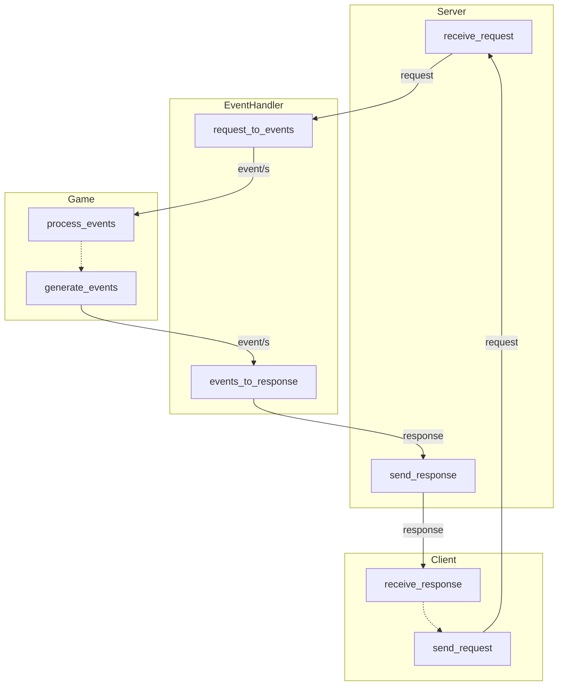

# ecs-game-engine

A piece of software or a framework aiming at covering the basics of gamedev

# 1. Architecture granularity level from top to bottom

1.1. Class granularity level

1.2. Method granularity level
1.2.1. Client class: method granularity level

1.2.2. Server class: method granularity level

1.2.3. EventHandler class: method granularity level

1.2.4. Game class: method granularity level

1.2.5. All classses

